¡Claro\! Aquí tienes un `README.md` completo para tu proyecto "Fake User API", incluyendo un diagrama de secuencia y las
secciones clave.

-----

# 🚀 Fake User API Playground

Este proyecto es una aplicación Spring Boot diseñada para consumir una API externa de usuarios aleatorios (
`randomuser.me`) utilizando **Spring Cloud OpenFeign**. Sirve como un *playground* para experimentar y entender la
integración de servicios REST con Feign, el manejo de respuestas HTTP y la gestión de errores en una aplicación Spring
Boot.

## 🌟 Características

* **Integración con Feign Client:** Consumo de `randomuser.me/api` a través de un cliente Feign.
* **Manejo de `ResponseEntity`:** Gestión de códigos de estado HTTP (`2xx`, `4xx`, `5xx`) para respuestas de la API
  externa.
* **Logging Detallado:** Configuración de `FeignLoggerConfig` para un nivel de registro `FULL` y un interceptor de
  solicitudes (`LogRequestInterceptor`) para trazar las peticiones internas.
* **Contenedor Web Embebido:** Servidor Tomcat embebido para un despliegue rápido.
* **API REST Sencilla:** Un único endpoint para obtener datos de un usuario aleatorio.

## 🛠️ Tecnologías Utilizadas

* **Java 17**
* **Spring Boot 3.x**
* **Spring Cloud OpenFeign**
* **Maven**
* **Jackson** (para serialización/deserialización JSON)

## 📝 Configuración del Proyecto

### Requisitos

* JDK 17 o superior
* Maven

### Clonar el Repositorio

```bash
git clone <URL_DE_TU_REPOSITORIO>
cd fake.user
```

### Propiedades de Configuración

El archivo `src/main/resources/application.properties` contiene las siguientes configuraciones:

```properties
spring.application.name=fake.user

server.port=8080
server.servlet.context-path=/playground

# Configuración de Swagger/OpenAPI (opcional)
springdoc.api-docs.path=/api-docs
springdoc.swagger-ui.path=/swagger-ui-custom.html

# Niveles de Log
logging.level.org.springframework.web=DEBUG
feign.client.config.default.loggerLevel=full

# Habilitar Feign con OkHttp (opcional, si se usa)
feign.okhttp.enabled=true

# Configuración de la API externa
# Se usa 'url' para la base y 'path' para el segmento de la API
api.fake-user.url=${FAKE_USER_API_URL:https://randomuser.me/}
api.fake-user.base.path=${FAKE_USER_API_BASE_PATH:api}
```

**Nota:** Las variables `FAKE_USER_API_URL` y `FAKE_USER_API_BASE_PATH` pueden ser sobreescritas por variables de
entorno si se desea.

### Construir y Ejecutar

Para construir el proyecto:

```bash
mvn clean install
```

Para ejecutar la aplicación:

```bash
mvn spring-boot:run
```

La aplicación se iniciará en `http://localhost:8080/playground`.

## 🌐 Endpoints de la API

Una vez que la aplicación esté en ejecución, puedes acceder al siguiente endpoint:

### `GET /playground`

Obtiene datos de un usuario aleatorio de la API `randomuser.me`.

* **URL:** `http://localhost:8080/playground`
* **Método:** `GET`
* **Respuesta Exitosa (Ejemplo):**
  ```json
  {
      "results": [
          {
              "gender": "female",
              "name": {
                  "title": "Miss",
                  "first": "Felecia",
                  "last": "Rose"
              },
              // ... más datos del usuario ...
          }
      ],
      "info": {
          "seed": "fb283dedef66377e",
          "results": 1,
          "page": 1,
          "version": "1.4"
      }
  }
  ```
* **Códigos de Estado:**
    * `200 OK`: Si la llamada a la API externa es exitosa.
    * `500 Internal Server Error`: Si hay un error de comunicación con la API externa o un error interno no manejado.
    * `4xx Client Error` / `5xx Server Error`: Si la API externa devuelve un error, se propagará como una
      `ResponseStatusException`.

## 📈 Diagrama de Secuencia

Este diagrama ilustra el flujo de una solicitud `GET /playground` a través de la aplicación, incluyendo la interacción
con el Feign Client y la API externa.

```mermaid
sequenceDiagram
    participant Cliente as Cliente (Navegador/Postman)
    participant SpringApp as Aplicación Spring Boot
    participant Controlador as FakeApiController
    participant Servicio as FakeUserApiServiceImpl
    participant FeignClient as FakeUserApiClient (Feign)
    participant APIExterna as randomuser.me/api

    Cliente->>SpringApp: GET /playground/
    SpringApp->>Controlador: Llama a getFakeUser()
    Controlador->>Servicio: Llama a getFakeUserData()
    Servicio->>FeignClient: Llama a getFakeUser() (Proxy de Feign)
    FeignClient->>APIExterna: Petición GET a https://randomuser.me/api

    alt Si la API externa responde OK (2xx)
        APIExterna-->>FeignClient: Respuesta JSON (2xx)
        FeignClient-->>Servicio: ResponseEntity<Object> (con cuerpo JSON)
        Servicio->>Servicio: Verifica Status Code (is2xxSuccessful)
        Servicio-->>Controlador: Retorna el body (Object)
        Controlador-->>SpringApp: ResponseEntity<Object> (200 OK con body)
        SpringApp-->>Cliente: Respuesta JSON (200 OK)
    else Si la API externa responde con un Error (4xx/5xx)
        APIExterna-->>FeignClient: Respuesta JSON/Error (4xx/5xx)
        FeignClient-->>Servicio: ResponseEntity<Object> (con body/error)
        Servicio->>Servicio: Verifica Status Code (is4xxClientError/is5xxServerError)
        Servicio--xControlador: Lanza ResponseStatusException
        Controlador--xSpringApp: Excepción propagada
        SpringApp-->>Cliente: Error HTTP (4xx/5xx)
    else Si hay un Fallo de Comunicación (timeout/conexión)
        FeignClient--xServicio: Lanza FeignException
        Servicio->>Servicio: Captura FeignException
        Servicio--xControlador: Lanza ResponseStatusException (500 Internal Server Error)
        Controlador--xSpringApp: Excepción propagada
        SpringApp-->>Cliente: Error HTTP (500 Internal Server Error)
    end
```



-----

## 👨‍💻 Contribuciones

Siéntete libre de clonar, modificar y experimentar con este proyecto. Las contribuciones son bienvenidas, especialmente
si ayudan a mejorar el entendimiento de Feign y las buenas prácticas de diseño de APIs.

## 📄 Licencia

Este proyecto está bajo la licencia MIT. Consulta el archivo `LICENSE` para más detalles.

-----